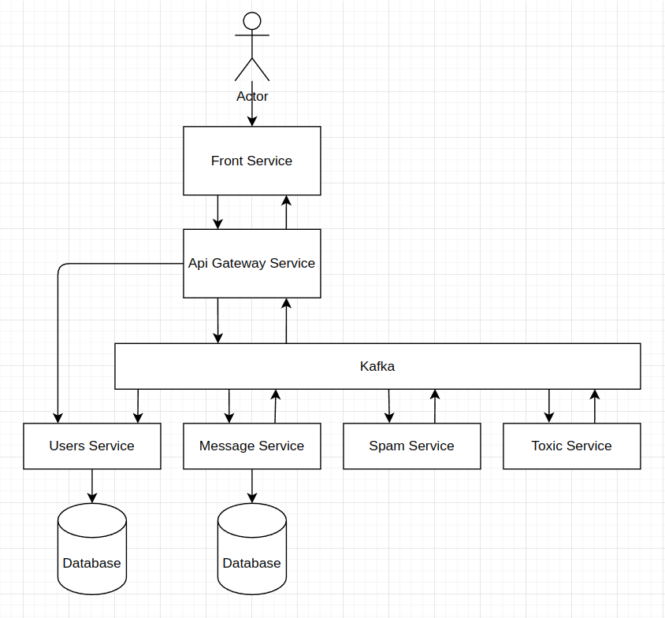
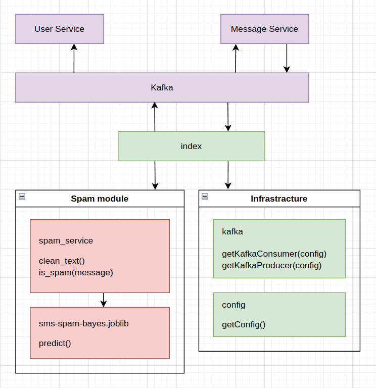

## Microservices for beginners. Spam service. Python. Scikit-learn. Kafka.

Spam service provides spam analysis of messages. I use a publish-subscribe pattern through Kafka message broker. And Scikit-learn model for text analysis.

Full code - [link](https://github.com/Igorok/micro-spam)

### Whole scheme:



Short description:

- User opens the front-end application in the browser and writes messages.
- Front-end service emits messages to the api gateway through socket.io.
- Api gateway emits messages in the Kafka topic for new messages.
- Message service subscribes to the topic with new messages, saves them and publishes events into the topic for saved messages.
- Users in the front-end service receive messages in the browser from the Api gateway.
- Spam service subscribes to the Kafka topic with saved messages. Scikit-learn
 model analyzes messages. Messages which were predicted as spam do publish into the Kafka topic for analyzed messages.
- Message and User services listen to events with spam and toxic messages, mark them in the database, and apply domain logic after receiving these events.


### Scheme of spam service:



`src/index.py` - this file contains initialization of the service. `src/index.py` - this file contains initialization of the service. `main` function gets configuration, connects to Kafka consumer and producer, and provides publish-subscribe events.

```python
from infrastructure.config import getConfig
from spam_module.spam_service import SpamService
from infrastructure.kafka import getKafkaConsumer, getKafkaProducer


def main():
    config = getConfig()
    consumer = getKafkaConsumer(config)
    producer = getKafkaProducer(config)
    spam_service = SpamService()

    print('spam-service started')

    for message in consumer:
        try:
            if not message.value.get('message'):
                continue

            is_spam = spam_service.is_spam(message.value.get('message'))
            if is_spam:
                response = {
                    'id': message.value.get('id'),
                    'user_id': message.value.get('user_id'),
                    'analysis': {
                        'spam': True
                    }
                }
                producer.send(config['KAFKA_ANALYSIS_MESSAGE_TOPIC'], response)

        except Exception as error:
            print('error', error)


if __name__ == '__main__':
    main()
```

`src/infrastructure/config.py` - this is the infrastructure helper, provides configuration for service.
```python
import os
from dotenv import dotenv_values


def getConfig():
    config = {
        **dotenv_values('./config/.env.dev'),  # load shared development variables
        **dotenv_values('./config/.env.prod'),  # load sensitive variables
        **os.environ,  # override loaded values with environment variables
    }
    return {
        'KAFKA_URI': config['KAFKA_URI'],
        'KAFKA_READY_MESSAGE_TOPIC': config.get('KAFKA_READY_MESSAGE_TOPIC'),
        'KAFKA_READY_MESSAGE_GROUP': config.get('KAFKA_READY_MESSAGE_GROUP'),
        'KAFKA_ANALYSIS_MESSAGE_TOPIC': config.get('KAFKA_ANALYSIS_MESSAGE_TOPIC'),
        'KAFKA_ANALYSIS_MESSAGE_GROUP': config.get('KAFKA_ANALYSIS_MESSAGE_GROUP'),
    }
```

`src/infrastructure/kafka.py` -this is the infrastructure helper, provides connection to Kafka.
```python
import json
from kafka import KafkaConsumer
from kafka import KafkaProducer


def getKafkaConsumer(config):
    return KafkaConsumer(
        config['KAFKA_READY_MESSAGE_TOPIC'],
        group_id=config['KAFKA_READY_MESSAGE_GROUP'],
        bootstrap_servers=[config['KAFKA_URI']],
        value_deserializer=lambda m: json.loads(m.decode('utf-8')),
    )

def getKafkaProducer(config):
    return KafkaProducer(
        bootstrap_servers=[config['KAFKA_URI']],
        value_serializer=lambda v: json.dumps(v).encode('utf-8')
    )

```

`src/spam_module/spam_service.py` - this file provides application logic. iHere located functionality for message preparation and prediction by the model - `spam_module/sms-spam-bayes.joblib`.
```python
import re
import string
from joblib import load


class SpamService:
    empty_message = 'Empty message!'
    model_path = './src/spam_module/sms-spam-bayes.joblib'

    def __init__(self):
        self.model = load(self.model_path)

    def clean_text(self, text):
        text = str(text).lower()
        text = re.sub('\[.*?\]', '', text)
        text = re.sub('https?://\S+|www\.\S+', '', text)
        text = re.sub('<.*?>+', '', text)
        text = re.sub('[%s]' % re.escape(string.punctuation), '', text)
        text = re.sub('\n', '', text)
        text = re.sub('\w*\d\w*', '', text)
        return text

    def is_spam(self, message):
        if not message:
            raise ValueError(self.empty_message)

        message = self.clean_text(message)
        prediction = self.model.predict([message])

        return True if prediction[0] == 1 else False

```

### Scikit-learn model

I used ["SMS Spam Collection Dataset"](https://www.kaggle.com/datasets/uciml/sms-spam-collection-dataset) to make simple spam classification. Excellent explanation for text classification for this dataset located [here](https://www.kaggle.com/code/faressayah/natural-language-processing-nlp-for-beginners).

How to make a spam detection model? My notebook [here](https://www.kaggle.com/code/igordubinin/sms-spam).

Import modules

```python
import numpy as np
import pandas as pd
import re
import string

from joblib import dump, load
from sklearn.pipeline import Pipeline
from sklearn.metrics import accuracy_score
from sklearn.naive_bayes import MultinomialNB
from sklearn.metrics import classification_report
from sklearn.model_selection import train_test_split
from sklearn.feature_extraction.text import CountVectorizer
from sklearn.feature_extraction.text import TfidfTransformer
```

Read data from file
```python
data_csv = pd.read_csv('/kaggle/input/sms-spam-collection-dataset/spam.csv', encoding='latin-1')
data_csv.head()
```

Create dataframe for analysis
```python
data_csv = data_csv[['v1', 'v2']]
data_csv.shape
```

Check empty fields
```python
data_na = data_csv['v1'].isna().sum()
data_na
```
```python
data_na = data_csv['v2'].isna().sum()
data_na
```

Check duplicates
```python
data_duplicates = data_csv.duplicated(subset=['v2']).sum()
data_duplicates
```

Remove duplicates
```python
data_csv = data_csv.drop_duplicates(subset=['v2'])
data_csv.shape
```

Data analysis work with numbers. Add new column - "class", ham will 0, spam will 1
```python
data_csv['class'] = data_csv.apply(lambda row: 1 if row['v1'] == 'spam' else 0, axis=1)
data_csv.head()
```

Data frame usually not prepared for analysis, and contain a lot of not useful symbols.
```python
data_csv[data_csv['v2'].str.find('http:') > -1].head()
```

Method for removing useless symbols, from [here](https://www.kaggle.com/code/andreshg/nlp-glove-bert-tf-idf-lstm-explained).
```python
def clean_text(text):
    text = str(text).lower()
    text = re.sub('\[.*?\]', '', text)
    text = re.sub('https?://\S+|www\.\S+', '', text)
    text = re.sub('<.*?>+', '', text)
    text = re.sub('[%s]' % re.escape(string.punctuation), '', text)
    text = re.sub('\n', '', text)
    text = re.sub('\w*\d\w*', '', text)
    return text
```

Add new column with clean text - "clean_text".
```python
data_csv['clean_text'] = data_csv.apply(lambda row: clean_text(row['v2']), axis=1)
data_csv.head()
```

Check http links
```python
data_csv[data_csv['clean_text'].str.find('http:') > -1]
```

Prepare data for analysis. We need data to train model. And data to check working of our model.

train_test_split - Split arrays or matrices into random train and test subsets.

x_train, y_train - data to train model

x_test, y_test - data to check result of model
```python
data_x = data_csv['clean_text']
data_y = data_csv['class']
x_train, x_test, y_train, y_test = train_test_split(data_x, data_y, train_size=0.8, test_size=0.2, random_state=10)
```

Prediction
CountVectorizer - convert a collection of text documents to a matrix of token counts. Ml algorithms working with numbers, so we need to convert our text to list of numbers.

MultinomialNB - naive bayes classifier for multinomial models. This is old classification algorithm, but working still good for classification issues.
```python
bays_model = Pipeline([
    ('count', CountVectorizer(stop_words='english')),
    ('model', MultinomialNB())
])
bays_model.fit(x_train, y_train)
bayes_y_pred = bays_model.predict(x_test)
```

Result of classification:

Precision is defined as the number of true positives over the number of true positives plus the number of false positives.

Recall is defined as the number of true positives over the number of true positives plus the number of false negatives.
```python
print(classification_report(y_test, bayes_y_pred, target_names=('spam', 'ham')))
```

Visualisation of results
```python
import matplotlib.pyplot as plt
import seaborn as sns
from sklearn.metrics import confusion_matrix

f, ax = plt.subplots(figsize=(9, 6))
sns.heatmap(confusion_matrix(y_test, bayes_y_pred), annot=True, fmt="d")
```

Sources:

[Natural Language Processing (NLP) for Beginners](https://www.kaggle.com/code/faressayah/natural-language-processing-nlp-for-beginners)

### Instalation

Python venv

```
python3 -m venv .venv
source .venv/bin/activate
```

Install packages

```
pip install -e .
```

Testing
```
python -m unittest
```

Launch
```
python src/index.py
```
